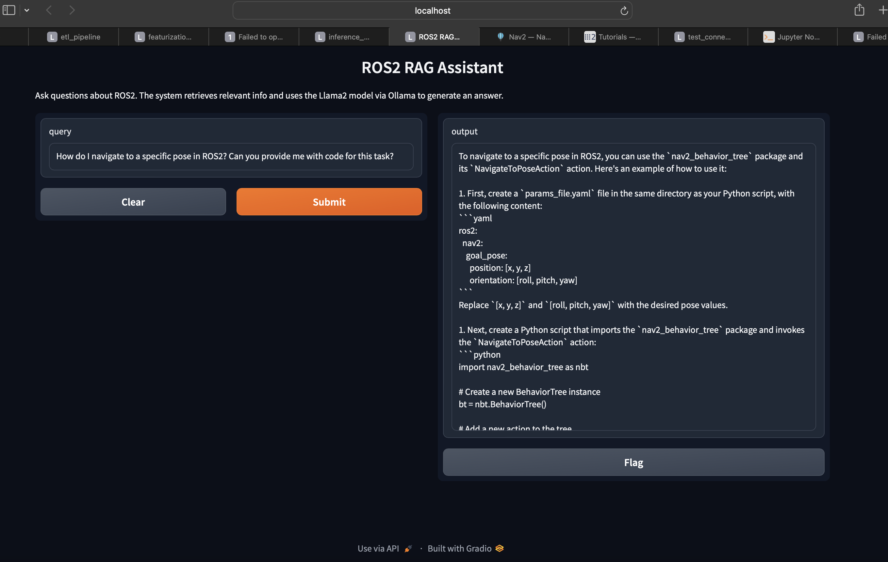

# 🤖 ROS2 RAG Assistant

An AI-powered assistant built for the ROS2 Navigation Stack using a Retrieval-Augmented Generation (RAG) approach. This system integrates MongoDB, Qdrant, and LLaMA 2 via Ollama to provide accurate, domain-specific responses to robotics-related queries.

---

## 🧪 Example Query

> **Query**: *"How do I navigate to a specific pose in ROS2?"*  
> **Answer**:
> ```
> Use NavigateToPoseAction with nav2_behavior_tree. Define a goal pose and create a client node...
> ```

<p align="center">
  
</p>

---

## 🔍 Key Features

- 🔗 **Retrieval-Augmented Generation**: Combines vector-based search with LLM-powered generation
- 📄 **Multi-source ETL**: Scrapes and processes ROS2 data from GitHub, YouTube, and Web
- 🧠 **Embeddings + Vector Search**: Chunks text and stores vectorized content in Qdrant
- 💬 **LLM Response via Ollama**: Uses a pre-trained LLaMA 2 model served via Ollama for generating answers
- 🌐 **Gradio UI**: Easy-to-use web interface for natural query interaction

---

## ⚙️ How It Works

1. ETL pipeline ingests data and stores it in MongoDB
2. Featurization pipeline chunks text and embeds it using SentenceTransformer
3. Vectors are stored in Qdrant for semantic search
4. Inference layer retrieves relevant chunks and prompts LLaMA 2 to generate responses
5. Gradio UI serves the system

---

## 🛠️ Tech Stack

- 🧠 LLaMA 2 (via Ollama)
- 🔎 Qdrant (vector search DB)
- 🧱 MongoDB
- 🐍 Python
- 🧪 SentenceTransformers
- 🖥️ Gradio (UI)

---

## 🧪 Evaluation

The system was evaluated manually on a small set of diverse, domain-specific ROS2 queries. Each response was assessed based on its correctness, relevance to the query, and clarity (including code examples where appropriate).

| Query Type                            | Evaluation Criteria         |
|---------------------------------------|-----------------------------|
| Navigation with ROS2                  | Accuracy, code snippet      |
| MoveIt2 motion planning               | API usage clarity           |
| Robot spawning in Gazebo              | Instructional correctness   |
| Behavior trees in ROS2 Nav2           | Technical depth             |
| ROS2 control system setup             | Relevance to domain         |

**Qualitative Result**: The system was tested over a subset of the indexed dataset. All responses provided contextually accurate and technically relevant answers based on retrieved content chunks.

---

## 🚧 Future Improvements

- Add automatic evaluation metrics (e.g. precision, BLEU, keyword coverage)
- Expand dataset size and diversity with more ROS2 subdomains
- Add plug-and-play LLM support (e.g. GPT-4, Mistral, Claude, Hugging Face models).
- Deploy via Hugging Face Spaces, FastAPI.


---
🔗 This project was built as part of my exploration in GenAI. Feel free to reach out for collaboration!

